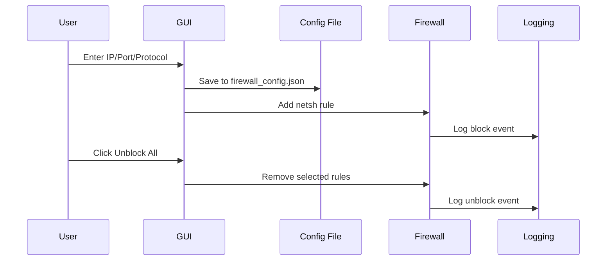
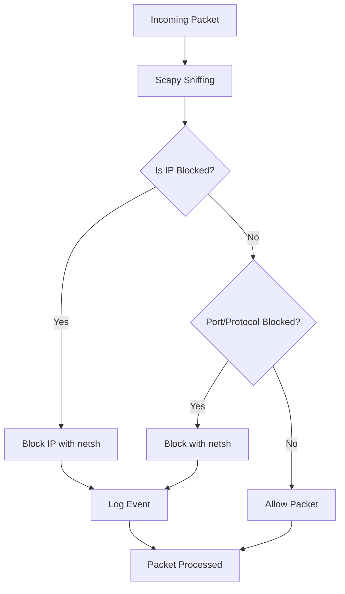

# Windows Firewall Manager (Python + Scapy + Tkinter)

A personal project to manage Windows Firewall using Python, with real-time packet monitoring via Scapy and easy configuration through a simple GUI built with Tkinter. The app lets you block/unblock IPs, ports, and protocols, all from a central interface - no deep tech knowledge required.

---

## What This Does

This tool helps you monitor your network and block unwanted connections directly on your Windows system. You can:

- Monitor incoming packets live
- Block IPs, ports, and protocols using friendly names (like `Block_IP_1.2.3.4`, `Block_Port_445`)
- Unblock only what you want (e.g., just ports or just TCP rules)
- Log blocked attempts with timestamps and reasons
- Modify or manually add rules through `firewall_config.json`, `blacklist.txt`, and `whitelist.txt`

> Note: This project is still under development! More features like outbound filtering, IPv6 support, and advanced rule management are planned.

---

## Key Features

- Real-time network monitoring with Scapy
- Block rules based on:
  - Specific IP addresses
  - Port numbers (e.g., 135, 445)
  - Protocols (TCP/UDP)
- User-friendly GUI for adding/removing rules
- JSON-based config for persistent storage (you can also edit the files manually)
- Smart unblock options by rule type
- Logging system for tracking events and rule changes

---

## Setup & Installation

### 1. Clone the Repository
```bash
git clone https://github.com/Farashjr/windows-firewall.git
cd windows-firewall
```

### 2. Install Dependencies
```bash
pip install -r requirements.txt
```

> Required packages include:
> - `scapy`
> - `tkinter` (included with most Python installs)

### 3. Run the App (Admin Required)
```bash
python firewall_gui.py
```

Make sure to run it as **Administrator**, or firewall rules won't be applied.

---

## How to Use

### GUI Overview:
- Add IP/Port/Protocol to block
- See current rules in a list
- Unblock by type (IP / Port / Protocol)
- Manage config files directly if needed

### CLI Option:
You can also run the background packet monitor with:
```bash
python firewall_windows.py
```

---

## Mermaid Diagrams

### 1. System Architecture
```mermaid
graph LR
    A[User Interface] --> B[GUI (Tkinter)]
    B --> C[Manage Configurations]
    C --> D[Update firewall_config.json]
    B --> E[Display Current Rules]
    D --> F[Update Windows Firewall via netsh]
    E --> F
    F --> G[Logging System]
    G --> H[Event Logs]
```

### 2. Workflow: Blocking & Unblocking


### 3. Packet Flow


---

## File Structure
```bash
windows-firewall/
├── firewall_gui.py          # GUI Application
├── firewall_windows.py      # Packet Monitor & Rule Engine
├── firewall_config.json     # Saved rules (IP/Port/Protocol)
├── whitelist.txt            # Safe IPs
├── blacklist.txt            # Known bad IPs
├── logs/
│   └── firewall.log         # Activity log
└── README.md
```

---

## Contributing

Want to help improve this project?
- Add features like outbound filtering
- Make the logs more detailed
- Improve error handling and validations
- Improve compatibility with different Windows versions

Pull requests are welcome!

---

## License
MIT License. Feel free to use or adapt this project in your own tools, labs, or personal setups.
